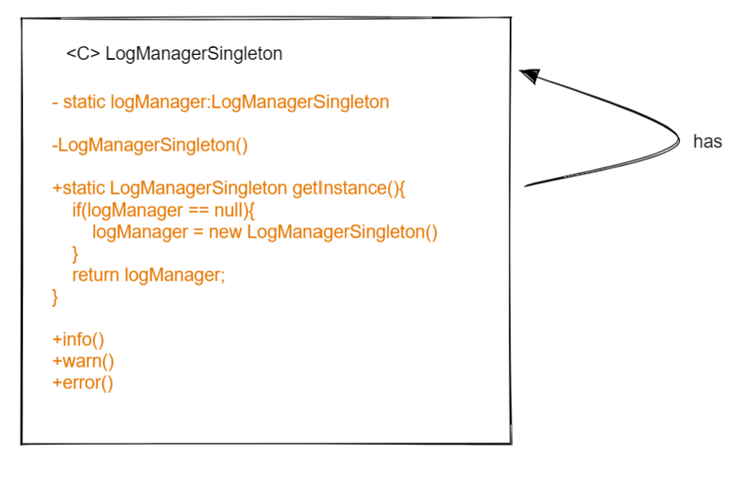
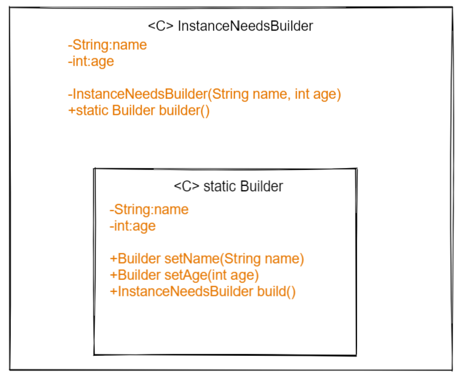

# reviewing-patterns

Repo created to review different software patterns

## CREATIONAL PATTERNS  

### Singleton Pattern



- Uses
  - Restricts the instantiation of a class and ensures that only one instance of the class exists in the java virtual machine
- To take into consideration
  - We are playing with global variables which is not thread-safe

  - Mocking static brings a lot of headaches

  - The fact that it is not thread-safe and we using global variables make the state uncertain during tests and that create temporal coupling,
  where the tests should be totally independent of each other.

### Builder Pattern



- Uses
  - Help to instantiate objects that are complex to create.
  - An example of use
  
  ```InstanceNeedsBuilder instance = InstanceNeedsBuilder.builder().setAge(9).setName("Name").build();```
- To take into consideration
  - The version of the builder that we review in this repo has a static nested class. this is necessary to be able 
  to call this class without an instance of the outer class.
  - Violation of CQS (Command-Query Separation) as the setters in the builder run a command (they set a value) and they 
  run a query (return the builder class).

### Factory Method Pattern
- Uses
  - Uses **factory methods** to instantiate objects instead of calling the exact class itself using new.
  
- To take into consideration
  - We give the responsibility of instantiation to other class rather than the object.

### Factory  Pattern
- Uses
  - It reminds me of a Facade Pattern for creation purposes. You collect the creation logic into a factory that you
  use to avoid exposing the logic to the client.
- To take into consideration
  - Use of static on the make method in the factory, static modifier makes functionality difficult to test/mock
  - Use of switch to divert the flow. Polymorphism is a solution for this problem.

### Prototype  Pattern
- Uses
  - Use to clone object avoiding dependencies among them. Done carefully, deep copying can be achieved. 
- To take into consideration
  - The idea of implementing this way is because we will have access to private objects internally in the object 
  - It is necessary to implement prototype not only in the object you want to clone but in the object that compose
  the main one. In this case, Car and GPS implement prototype because we do not only want to clone Car but the GPS inside the car.
  Otherwise, different car instances will hold the same GPS instance.
