# reviewing-patterns

Repo created to review different software patterns

## CREATIONAL PATTERNS

### Singleton Pattern


- Uses
    - Restricts the instantiation of a class and ensures that only one instance of the class exists in the java virtual
      machine
- To take into consideration
    - We are playing with global variables which is not thread-safe

    - Mocking static brings a lot of headaches

    - The fact that it is not thread-safe and we using global variables make the state uncertain during tests and that
      create temporal coupling,
      where the tests should be totally independent of each other.

### Builder Pattern


- Uses
    - Help to instantiate objects that are complex to create.
    - An example of use

  ```InstanceNeedsBuilder instance = InstanceNeedsBuilder.builder().setAge(9).setName("Name").build();```
- To take into consideration
    - The version of the builder that we review in this repo has a static nested class. this is necessary to be able
      to call this class without an instance of the outer class.
    - Violation of CQS (Command-Query Separation) as the setters in the builder run a command (they set a value) and
      they
      run a query (return the builder class).

### Factory Method Pattern

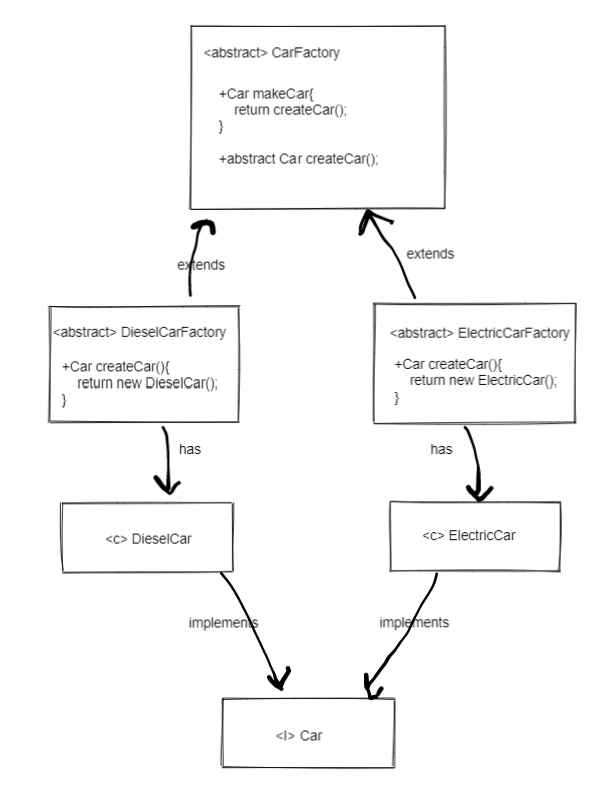

- Uses
    - Uses **factory methods** to instantiate objects instead of calling the exact class itself using new.

- To take into consideration
    - We give the responsibility of instantiation to other class rather than the object.

### Factory  Pattern

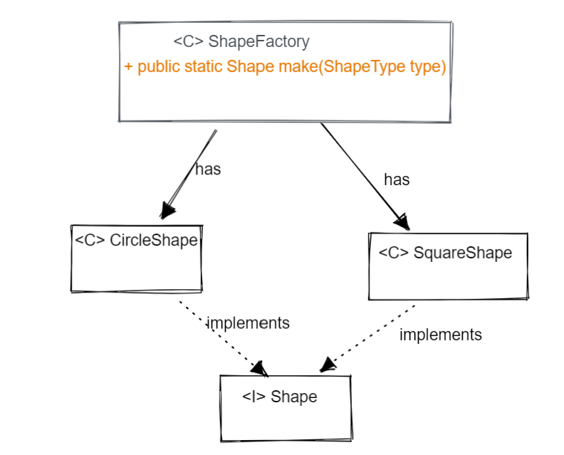

- Uses
    - It reminds me of a Facade Pattern for creation purposes. You collect the creation logic into a factory that you
      use to avoid exposing the logic to the client.
- To take into consideration
    - Use of static on the make method in the factory, static modifier makes functionality difficult to test/mock
    - Use of switch to divert the flow. Polymorphism is a solution for this problem.

### Prototype  Pattern

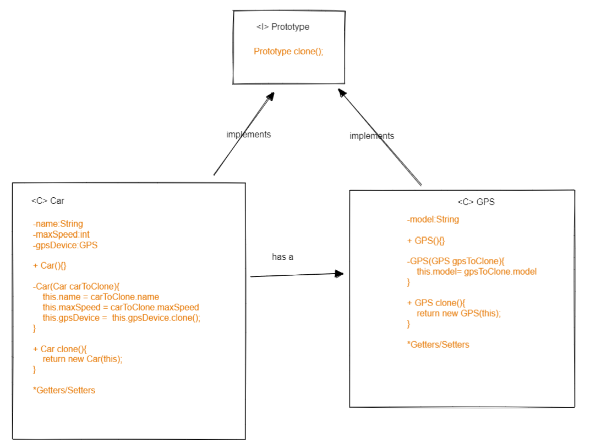

- Uses
    - Use to clone object avoiding dependencies among them. Done carefully, deep copying can be achieved.
- To take into consideration
    - The idea of implementing this way is because we will have access to private objects internally in the object
    - It is necessary to implement prototype not only in the object you want to clone but in the object that compose
      the main one. In this case, Car and GPS implement prototype because we do not only want to clone Car but the GPS
      inside the car.
      Otherwise, different car instances will hold the same GPS instance.

### Abstract Factory Pattern

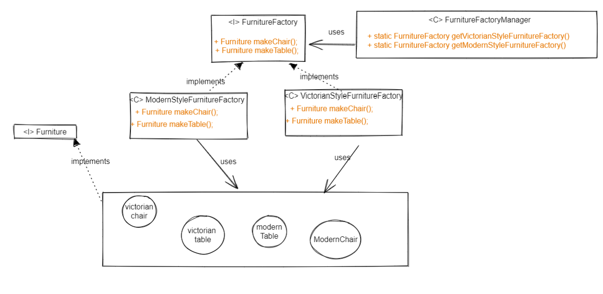

- Uses
    - Allows you to create different factories to create items of different families.
- To take into consideration
    - I used different methods instead of a switch to control the flow what to choose. I guess it depends on the
      context that this may be the best option.

## BEHAVIOURAL PATTERNS

### State Pattern

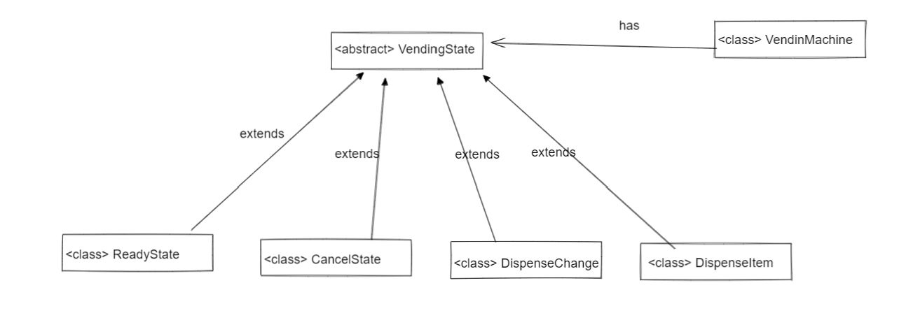
For this example, the State Machine for the Vending Machine would be:
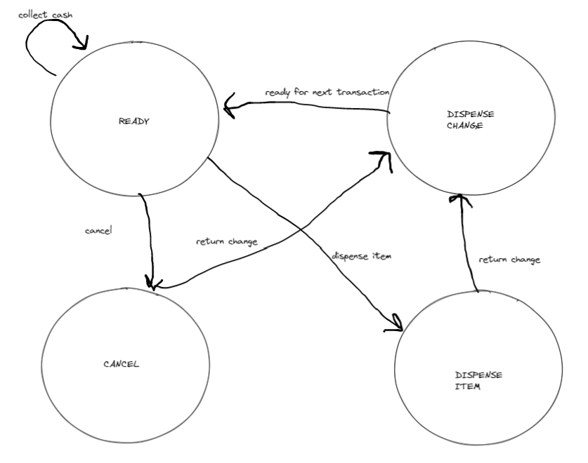

- Uses
    - An object contains a state and its behaviour is able to mutate depending on its specific state
- To take into consideration
    - Interface Segregation Principle violated over Liskov Substitution Principle, due to the fact that one particular
      state can go to different ones
      there will be combinations that will not make sense. I guess there is a way of fixing this, although I am now
      exploring the pattern. I will
      try to improve in the future.
- ### Strategy Pattern

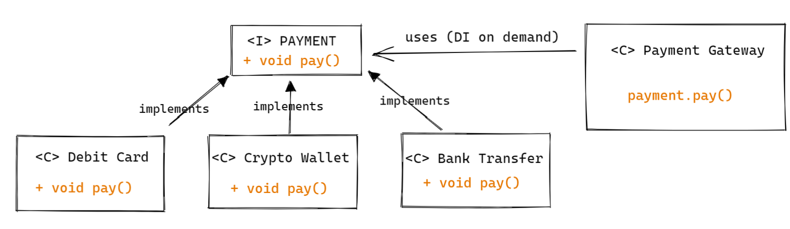

- Uses
    - Allows you to choose different algorithms at runtime to achieve an objective. In the case of this example,
      it lets us choose what type of payment strategy we want to use to accomplish the objective of paying for items.
    - The difference with visitor is that different strategies are applied to one target. Whereas in visitor,
      we focus on one algorithm that is applied to different targets.
- To take into consideration
    - I like this pattern, so maybe I got onboard with the details and got the problem too complicated for what it is
      in reality, I hope you can understand it. I really enjoyed it. For sure there are wrong things in the code, but
      the
      objective is to describe the pattern.

- ### Template Pattern

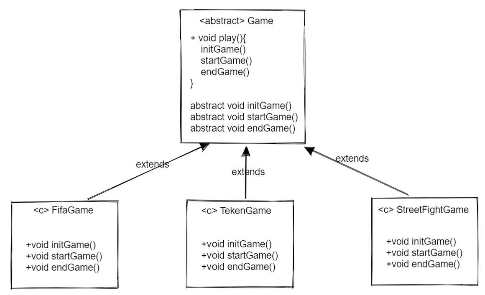

- Uses
    - Customise internal steps of a common process
- To take into consideration


- ### Observer Pattern

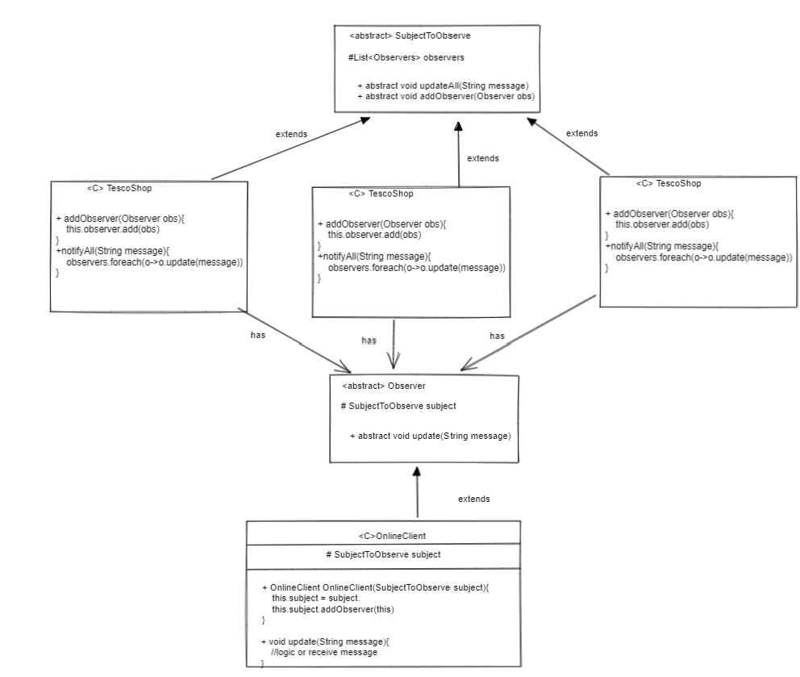

- Uses
    - Notify observers of state changes on observed object
- To take into consideration
    - In this example, the clients can only subscribe to one subject to be observed. But the general idea is to allow
      them to subscribe as many as they want.
    - The user is automatically subscribed on creation as you need the subject to observed when creating the user.
      This is just an example but realistically, the user will decide to subscribe way after the object is created.
    - Possibility of unsubscribe is not in the example

- ### Iterator Pattern (Simple)

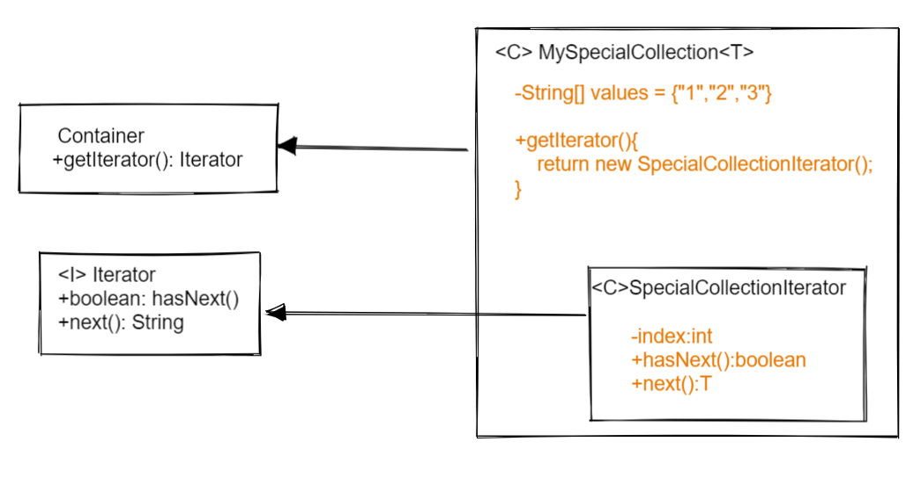

- Uses
    - Iterate your own data structure, and implement custom behaviour
- To take into consideration
    - For this example, we will use a data structure that only accepts Strings. Using Generics we could try to be more
      flexible.
    - For the container interface there is barely functionalities, we could think of adding add(), remove(), etc.
    - Remember that for the iterator we're implementing now, there is no feature that covers going backwards. In order
      to revisit an old element in the data structure you will need a new iterator.

- ### Memento Pattern

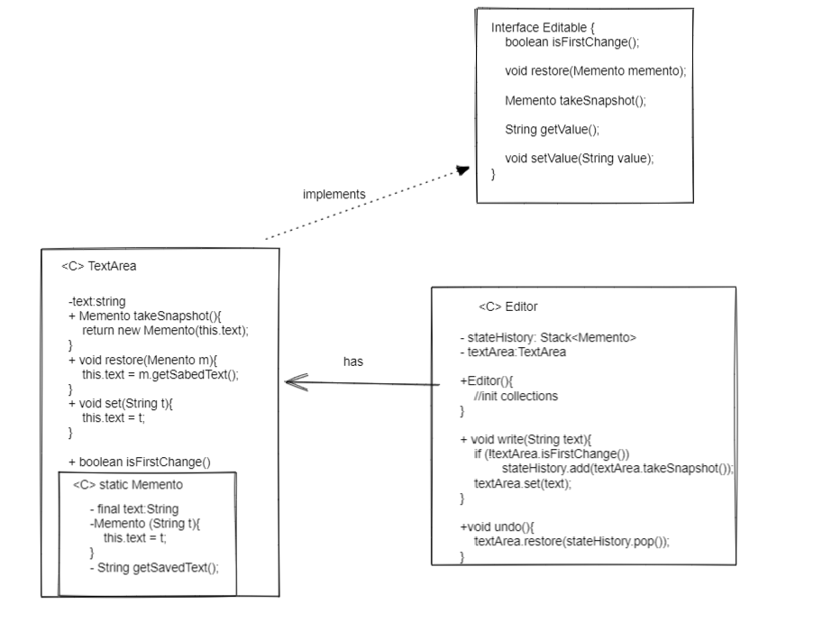

- Uses
    - Restore previous state of an object
- To take into consideration
    - the current example covers undo features for Strings, via using Generics we could adapt this to different objects
      types.


- ### Chain Of Responsibility Pattern

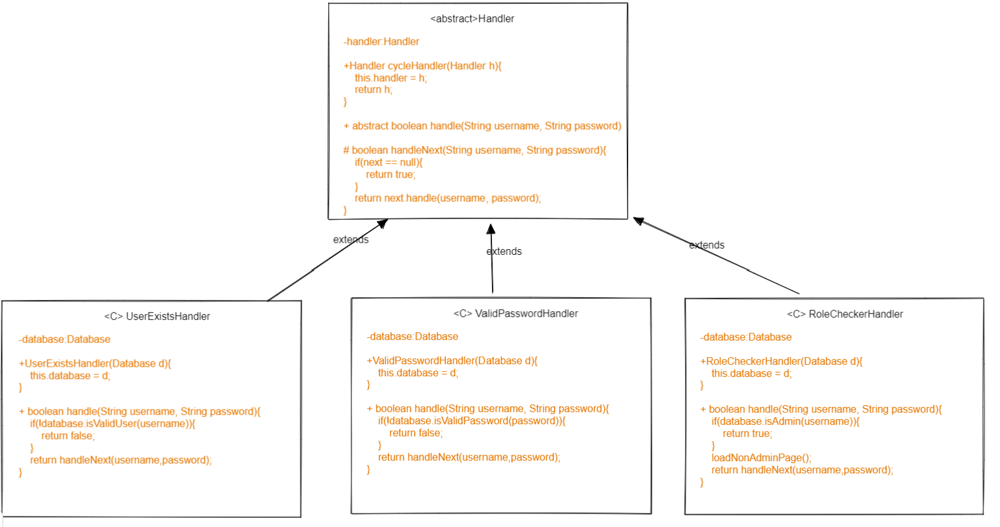

- Uses
    - Chain of objects with different responsibilities towards completing a task
- To take into consideration
    - In the main, the way we cycle handlers is a little awkward because the return, returns the last cycled
      handler if you do everything on a one-liner. Another solution would be to start from the last handler and go back,
      that feels pretty weird.
    - The 'DatabaseConnection' emulates connecting to a DB and checking the username, password and role.
    - cycleHandler() violates CQS as it is a command that also returns an object.


- ### Command Pattern

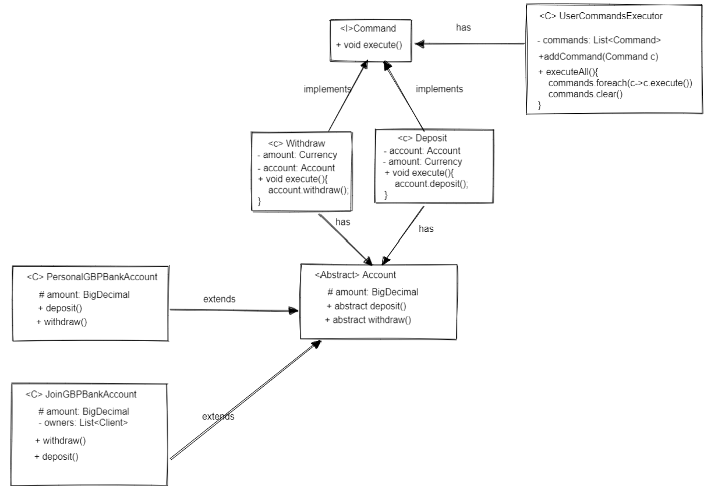

- Uses
    - Requests are wrapped in objects and passed to invoker
- To take into consideration
    - Customer object was added to show that in different classes we can apply commands, that class is empty for this
      example


- ### Visitor Pattern

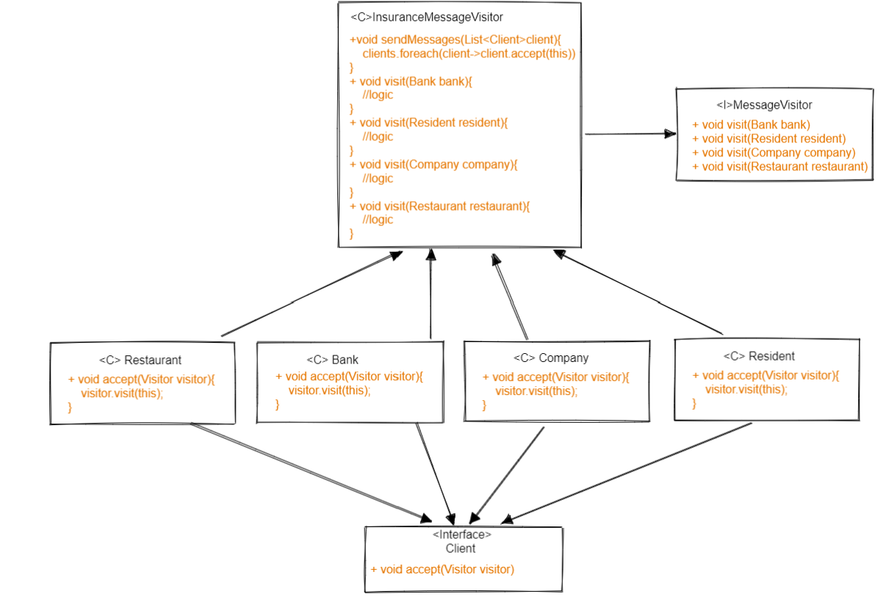

- Uses
  - Apply an algorithm to different target objects, the difference with Strategy is that we apply one algorithm to
  different targets
- To take into consideration
  -  